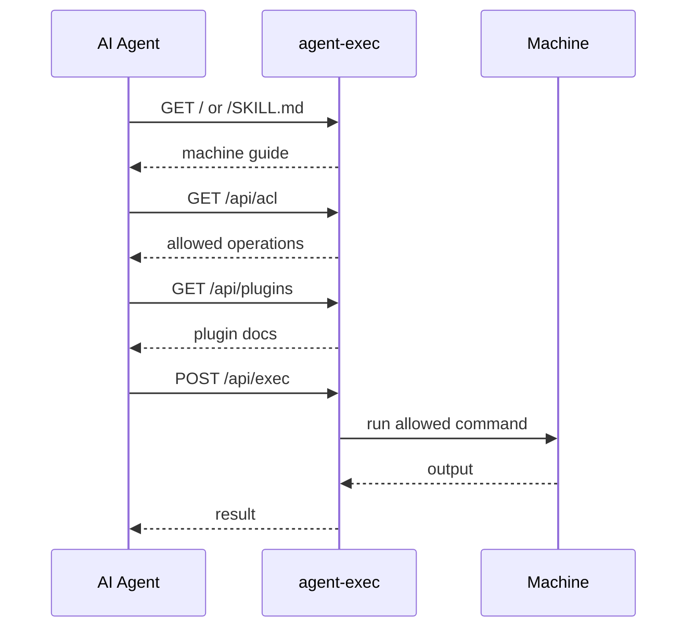

<h1 align="center">
  <br>
  
  <br>
</h1>

<p align="center">
  SSH-like machine access for AI agents through a self-describing, ACL-controlled HTTP entry point.
</p>

<p align="center">
  <strong>Give AI agents a machine endpoint. The machine explains itself, and the server enforces what agents may do.</strong>
</p>

<p align="center">
  Fresh installs are safe by default: only <code>aexec --version</code> is allowed.
  Expose useful operations with starterkits or plugins you choose.
</p>

<p align="center">
  <a href="https://github.com/to-agent/agent-exec#readme">English</a> |
  <a href="https://github.com/to-agent/agent-exec/blob/main/docs/i18n/README.ja.md">日本語</a> |
  <a href="https://github.com/to-agent/agent-exec/blob/main/docs/i18n/README.zh.md">简体中文</a>
</p>

---

## Quick Start

On a machine that already has Node.js and npm:

```bash
npm i -g @to-agent/agent-exec
```

```bash
aexec setup        # generate API_KEY
```

```bash
aexec start        # start the server
```

```bash
aexec share        # generate a prompt for an AI agent
```

Then paste the generated prompt into an AI agent.

`aexec setup` creates the local API_KEY and settings. `aexec start` starts the endpoint. `aexec share` prints the prompt.

`aexec` is the official command. `ae` is the short alias for daily use.

### Safe Default vs Useful Operations

The quick start above is intentionally conservative. Fresh installs only allow
`aexec --version`, so an agent can verify discovery and `/api/exec` without
getting broad machine access.

To expose useful operations, add a starterkit or plugin, review the generated
settings, and then share the machine again:

```bash
aexec starterkit
aexec restart
aexec share
```

If the server is not running yet, run `aexec starterkit` before `aexec start`.
If it is already running, use `aexec restart` so the new plugin/runtime settings
are loaded.

`aexec starterkit` prints each generated `settings.json` by default so you can
review new `exec.allow` rules before restart. Use `--silent` or `--quiet` to
suppress that output.

Starter Kit and `aexec plugin create` generate conservative ACL entries by
default: manual plugins use `<cmd> --help` / `<cmd> --version`, and scan-based
plugins use the help/version flags actually detected from the CLI. They do not
generate broad `cmd *` rules. Use `aexec plugin doctor` to detect broad wildcard
ACL rules before restart.

`aexec share` prints a prompt like this:

```text
You have access to a machine through agent-exec.

URL:     http://127.0.0.1:3333
API_KEY: <API_KEY>

Start here:
http://127.0.0.1:3333/SKILL.md
```

Paste it into Claude, Gemini, Codex, Hermes, OpenClaw, or any agent that can make HTTP requests.
By default this is local-machine handoff.
For a trusted LAN or disposable canary machine, bind to a network interface and pass the reachable host explicitly:

```bash
aexec start -f --public
aexec share --ip <reachable-host-or-ip>
```

Do not expose agent-exec directly to the public internet. Treat the API_KEY as machine execution capability. Use localhost, VPN, firewall, TLS termination, or another trusted network boundary.

Before sharing:

- agent-exec is not a sandbox.
- agent-exec is not SSH-compatible and is not an SSH replacement.
- Fresh installs only allow `aexec --version`.
- Do not expose plain HTTP agent-exec to the public internet.
- Run agent-exec as a least-privileged OS user.

### AI-Assisted Install Prompt

You can also paste this prompt into a local AI coding agent and let it install agent-exec for you:
The standalone file is [agent-exec.install.skill.md](./agent-exec.install.skill.md).

```text
Install agent-exec on this machine.

Goal:
- Install @to-agent/agent-exec globally.
- Run the first-time setup.
- Start the local server.
- Show me the final aexec share prompt.

Steps:
1. Check that Node.js and npm are available:
   node --version
   npm --version
2. Install agent-exec:
   npm install -g @to-agent/agent-exec
3. Verify the CLI:
   aexec --version
4. Run setup:
   aexec setup
5. Start the server for local use:
   aexec start
6. Generate the handoff prompt:
   aexec share

Constraints:
- Do not edit project files unless required for installation.
- Do not expose agent-exec to the public internet.
- Do not use --public unless I explicitly ask for network access.
- Do not add broad ACL rules such as allow "*".
- Fresh installs should only allow: aexec --version.
- Useful operations are not exposed by default. If I ask for a useful plugin demo, run:
  aexec starterkit
  aexec restart
  aexec share
  and show me the generated settings before proceeding.
- If any command fails, stop and show me the error plus the next recommended command.
```

---

## What It Does

agent-exec gives an AI agent a small, self-describing entry point into a machine.

```text
Agent receives a machine endpoint + credential
  -> GET  / or /SKILL.md                  read the machine guide
  -> GET  /api/acl                        inspect allowed operations
  -> GET  /api/plugins                    discover optional plugin docs
  -> GET  /private/skills/:name/SKILL.md  read private plugin docs when linked
  -> POST /api/exec                       execute an allowed command
```



The server remains in control. The agent discovers what exists, but the machine decides what is allowed.

---

## Core Endpoints

Public:

| Path | Purpose |
|---|---|
| `GET /` | Runtime root guide |
| `GET /SKILL.md` | Main agent guide |
| `GET /skills` | Skills index |
| `GET /skills/:name/SKILL.md` | Public skill docs |

Normal discovery starts from `/` or `/SKILL.md`. Skill documents are also
available as `.json`, `.html`, and Skill Script `.s.js` / `.sjs` documents for
direct machine-readable access. For example, `/SKILL.s.js`,
`/api/acl/SKILL.s.js`, `/api/exec/SKILL.s.js`, and
`/skills/:name/SKILL.s.js` are documentation surfaces. Public API skill
documents are discoverable, while API runtime calls and private namespaces such
as `/private/*` still require API_KEY.

API_KEY required:

| Path | Purpose |
|---|---|
| `GET /api/acl` | Allowed and denied commands |
| `GET /api/plugins` | Installed plugin docs |
| `POST /api/exec` | Execute a command |
| `GET /private/skills/:name/SKILL.md` | Private plugin docs |

Protected calls should use:

```bash
curl -H "X-API-Key: <API_KEY>" http://localhost:3333/api/acl
```

`Authorization: Bearer <API_KEY>` is also supported. Query-string auth is disabled by default and is intended only for explicit compatibility use.

---

## Execution

Commands are sent as an argument array:

```bash
curl -X POST http://localhost:3333/api/exec \
  -H "X-API-Key: <API_KEY>" \
  -H "Content-Type: application/json" \
  -d '{"args": ["aexec", "--version"]}'
```

Example response:

```json
{
  "output": "agent-exec v0.2.0\n",
  "exitCode": 0,
  "status": "done"
}
```

### Execution Semantics

`/api/exec` accepts command arguments from the JSON body:

```json
{"args": ["command", "arg1", "arg2"]}
```

agent-exec executes `args` as argv. It does not run commands through a shell, and it does not accept commands from query-string parameters.

Practical implications:

- `GET /api/exec` never executes. It returns HTTP 405.
- `POST /api/exec?cmd=...` and `POST /api/exec?args=...` do not execute query-string commands.
- Shell metacharacters such as `&&`, `;`, `|`, redirection, and subshell syntax are not interpreted by agent-exec itself.
- ACL rules are evaluated server-side against the submitted command and arguments.
- `exec.deny` is evaluated before `exec.allow`.
- Plain string ACL rules are exact matches only. Use explicit glob rules with `*` or regex rules with `/.../` when you intentionally want broader matching.
- Request body fields other than `args` and optional `memo` are rejected. `cmd`, `command`, `env`, `cwd`, and `shell` are not accepted by `/api/exec`.
- If you allow a tool such as `npm test`, that tool may run project scripts. agent-exec controls the outer execution boundary; it is not a sandbox for allowed tools.

---

## ACL

agent-exec is default-deny for machine operations. Fresh installs allow only `aexec --version` as a self-test command so agents can verify that `/api/exec` works.

For common allow-rule edits, use the ACL CLI:

```bash
aexec acl list
aexec acl add "date"
aexec acl add "codex *" --force --yes
aexec acl remove "date" --yes
aexec acl remove --contains "codex" --yes
aexec acl doctor
```

`aexec acl add` writes to the primary user settings file. Exact rules ask for confirmation in a TTY and require `--yes` in non-interactive use. Broad glob or regexp allow rules require stronger intent; non-interactive use requires `--force --yes`. `aexec acl remove --contains <text>` removes matching user allow rules after confirmation. User ACL changes are picked up by a running server on the next `/api/exec` request. `aexec acl doctor` reports broad effective allow rules.

Edit the host settings file created by `aexec setup`:

```bash
~/.to-agent/agent-exec/settings.json
```

```json
{
  "exec": {
    "allow": ["aexec --version", "date", "echo agent exec ok"],
    "deny": ["/^sudo/", "/rm\\s+-rf/"]
  }
}
```

`deny` is evaluated before `allow`. Configure ACLs carefully and run agent-exec as a least-privileged OS user.

ACL rule types:

| Rule | Meaning |
|---|---|
| `"aexec --version"` | Plain string. Matches exactly this command and argument; extra arguments do not match. |
| `"echo *"` | Glob. Explicit wildcard match; this allows any arguments to `echo`. |
| `"/^sudo/"` | Regexp. Explicit `/.../` pattern. |
| `"*"` | Allow-all unless denied. Avoid on shared or public-facing machines. |

A rule like `"cmd *"` allows any arguments to `cmd`. Use it only when the command itself is trusted to enforce safe behavior. `exec.deny` is always evaluated before `exec.allow`.

### Configuration Reload

`aexec setup` creates `~/.to-agent/agent-exec/settings.json`. This is the normal file to edit.

Settings are split into two groups so the behavior is predictable.

These settings are reloaded automatically, without `aexec refresh` or restart:

- `exec.allow`
- `exec.deny`
- `ip.allow`
- `ip.deny`
- `timeoutMs`
- `maxOutputBytes`
- `maxStreamBytes`
- `maxConcurrentExec`
- `killGraceMs`
- `audit.enabled`
- `audit.file`

These settings require `aexec restart` because they are used while the server is starting or while plugins are snapshotted:

- `.env`, `API_KEY`, `HOST`, `PORT`
- `AGENT_EXEC_ENABLED`, `AGENT_EXEC_ALLOW_QUERY_API_KEY`
- `maxRequestBodyBytes`, `rateLimit`
- plugin create / enable / runtime settings edits
- restart is recommended after plugin remove / disable to fully unload runtime code

There is no top-level `aexec refresh`: policy settings reload automatically, and plugin/runtime changes need a restart. To see exactly which files are used and which settings require restart:

```bash
aexec config
```

### Reset Local Config

Use `reset` when you want to move the active local config out of the way and
return the machine to a fresh safe state.

```bash
aexec reset --yes
```

`aexec reset` is different from `aexec setup`:

- `aexec setup` creates missing first-time files and is meant for initial setup.
- `aexec reset` backs up the current config directory, removes it from the
  active location, and recreates a fresh minimal config.

By default, reset backs up the current config directory to:

```text
~/.to-agent/backups/agent-exec/reset-YYYYMMDD-HHMMSS/
```

The backup includes the previous `.env`, `settings.json`, and `plugins/`.
The fresh config recreates `.env`, `settings.json`, and an empty `plugins/`
directory. Fresh reset settings only allow `aexec --version`.

API key behavior:

- Default: generate a new API_KEY.
- `--keep-api-key`: reuse the current API_KEY.
- `--api-key <key>`: write a specific API_KEY, useful for lab or device setup.

Inspection and destructive mode:

- `--dry-run`: show what would happen without changing files.
- `--json`: print machine-readable reset output.
- `--no-backup`: remove the active config without backup. Use only when you
  intentionally do not need the previous config.

For a remote test machine where you want to keep the same shared credential:

```bash
aexec reset --keep-api-key --yes
aexec start --public
```

---

## Plugins

Plugins add documentation and optional command behavior.

```bash
aexec plugin list
aexec plugin create --name=mytool --command=mytool
aexec plugin enable --name=mytool
aexec plugin disable --name=mytool
aexec plugin doctor
```

`aexec plugin create` prints the generated `settings.json` by default. Review its `exec.allow` rules before restart. Use `--silent` or `--quiet` to suppress that output.

Generated plugin ACLs are intentionally narrow. Add broader patterns manually
only after reviewing the generated skill and CLI behavior. `aexec plugin doctor`
reports broad wildcard rules such as `*` or `cmd *`.

Plugin changes are restart-aware. After creating or editing plugin runtime behavior, run:

```bash
aexec restart
```

Plugin trust boundary:

- Skill-only plugins are documentation only.
- Exec plugins may add hooks and routes, but normal execution still goes through ACL-checked command execution.
- Trusted plugins are trusted host code. A trusted plugin may use direct `api.run` behavior and should be reviewed like code running as the agent-exec OS user.
- Do not install unreviewed trusted plugins.

---

## Useful Commands

| Command | Purpose |
|---|---|
| `aexec setup` | Create local config and API_KEY |
| `aexec start` | Start server in background |
| `aexec start -f` | Start server in foreground |
| `aexec start -f --public` | Start in foreground bound to `0.0.0.0` |
| `aexec share --ip <host>` | Print a prompt using an explicit reachable host |
| `aexec stop` | Stop server |
| `aexec stop --force --port 3333` | Force kill the process bound to a port |
| `aexec restart` | Restart server |
| `aexec restart --force -f --public` | Force restart in foreground for canary testing |
| `aexec status` | Show server status |
| `aexec config` | Show config files and reload behavior |
| `aexec share` | Print prompt for another AI agent |
| `aexec key rotate` | Rotate the local API_KEY |
| `aexec acl ...` | Manage exec.allow rules |
| `aexec reset --yes` | Back up and recreate local config |
| `aexec starterkit` | Optional plugin generation for installed AI tools |
| `aexec plugin ...` | Manage plugins |

Run `aexec <command> --help` for command-specific help.

---

## Security Model

agent-exec is not a sandbox by itself. It is a policy-gated execution surface.

It is SSH-like machine access for AI agents, but it is not SSH-compatible and is not an SSH replacement.

agent-exec provides the mechanism:

- API_KEY authentication
- ACL enforcement
- timeout, output, stream, and concurrency limits
- local JSONL audit log without raw API_KEY values or stdout/stderr bodies
- explicit `AGENT_EXEC_ENABLED` master switch
- self-hosted operation

You are responsible for:

- what commands you allow
- avoiding direct public-internet exposure
- running behind localhost, VPN, firewall, TLS termination, or a trusted network
- avoiding plain HTTP on public networks
- running as a least-privileged OS user
- firewall/VPN/IP allowlists
- process and filesystem isolation
- rotating the API_KEY if it leaks: `aexec key rotate`

Same principle as SSH: the daemon provides the access surface. What you allow through it is the administrator's decision.

---

## License

Apache License 2.0.

The open-source core is licensed under Apache-2.0. Commercial services and to-agent trademarks may be offered under separate terms.
