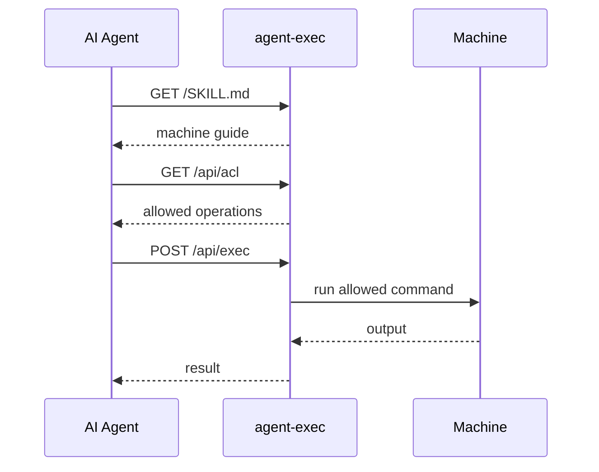

<h1 align="center">
  <br>
  
  <br>
</h1>

<p align="center">
  AI エージェント向けの SSH-like な machine access。自己記述型・ACL制御付き HTTP 入口です。
</p>

<p align="center">
  <strong>URL と API key を渡すだけ。エージェントは /SKILL.md を読み、/api/acl を確認し、/api/exec で実行します。</strong>
</p>

<p align="center">
  fresh install は安全側の初期値です。許可されるのは <code>aexec --version</code> だけです。
  実用的な操作は、選択した starterkit または plugin で公開します。
</p>

<p align="center">
  <a href="../../README.md">English</a> |
  <a href="README.ja.md">日本語</a> |
  <a href="README.zh.md">简体中文</a>
</p>

---

## クイックスタート

Node.js と npm が入っているマシンで実行します。

```bash
npm i -g @to-agent/agent-exec

aexec setup        # API key を生成
aexec start        # サーバー起動
aexec share        # AI エージェントへ渡すプロンプトを生成
```

`aexec` が正式コマンドです。`ae` は普段使いの短縮エイリアスです。

### 安全な初期値と実用的な操作

上のクイックスタートは意図的に保守的です。fresh install で許可されるのは
`aexec --version` だけなので、エージェントは discovery と `/api/exec` の
疎通確認はできますが、広い machine access は得ません。

実用的な操作を公開するには、starterkit または plugin を追加し、生成された
settings を確認してから、改めて共有します。

```bash
aexec starterkit
aexec restart
aexec share
```

まだサーバーを起動していない場合は、`aexec start` の前に `aexec starterkit`
を実行できます。すでに起動中の場合は、新しい plugin/runtime settings を
読み込むために `aexec restart` を使います。

`aexec starterkit` は、生成した各 `settings.json` をデフォルトで表示します。
restart 前に新しい `exec.allow` ルールを確認してください。表示を抑制する場合は
`--silent` または `--quiet` を使います。

`aexec share` は次のようなプロンプトを出力します。

```text
agent-exec を通じてマシンにアクセスできます。

URL: http://127.0.0.1:3333
API_KEY: <key>

ここから始めてください:
http://127.0.0.1:3333/SKILL.md
```

Claude、Gemini、Codex、Hermes、OpenClaw など、HTTP リクエストを実行できる AI エージェントに貼り付けます。
デフォルトでは同じマシン上のエージェント向けです。信頼できる LAN や使い捨て canary マシンで共有する場合は、ネットワーク interface に bind し、到達可能な host を明示します。

```bash
aexec start -f --public
aexec share --ip <reachable-host-or-ip>
```

agent-exec を public internet に直接公開しないでください。API key は machine execution capability として扱い、localhost、VPN、firewall、TLS termination、信頼できる network boundary の内側で使ってください。

共有前に確認してください。

- agent-exec は sandbox ではありません。
- agent-exec は SSH 互換ではなく、SSH の置き換えでもありません。
- fresh install で許可されるのは `aexec --version` だけです。
- plain HTTP の agent-exec を public internet に公開しないでください。
- agent-exec は least-privileged OS user で実行してください。

---

## 何をするものか

agent-exec は、AI エージェントがマシンを発見して操作するための小さな入口を提供します。

```text
エージェントが URL + API key を受け取る
  -> GET  /SKILL.md       マシンのガイドを読む
  -> GET  /api/acl        許可された操作を確認する
  -> GET  /api/plugins    plugin docs を発見する
  -> POST /api/exec       許可されたコマンドを実行する
```



エージェントは自律的に発見しますが、許可する内容は常にサーバー側が制御します。

---

## 主要エンドポイント

公開:

| Path | 用途 |
|---|---|
| `GET /` | 実行中サーバーの root guide |
| `GET /SKILL.md` | メインの agent guide |
| `GET /skills` | Skills index |
| `GET /skills/:name/SKILL.md` | 公開 skill docs |

API key 必須:

| Path | 用途 |
|---|---|
| `GET /api/acl` | 許可/拒否コマンド |
| `GET /api/plugins` | インストール済み plugin docs |
| `POST /api/exec` | コマンド実行 |
| `GET /private/skills/:name/SKILL.md` | private plugin docs |

保護された API にはヘッダーを使います。

```bash
curl -H "X-API-Key: <key>" http://localhost:3333/api/acl
```

`Authorization: Bearer <key>` も対応しています。query string 認証はデフォルト無効で、明示的な互換用途に限って使う想定です。

---

## 実行

コマンドは args 配列として送信します。

```bash
curl -X POST http://localhost:3333/api/exec \
  -H "X-API-Key: <key>" \
  -H "Content-Type: application/json" \
  -d '{"args": ["aexec", "--version"]}'
```

### 実行セマンティクス

`/api/exec` は JSON body の args だけを受け付けます。

```json
{"args": ["command", "arg1", "arg2"]}
```

agent-exec は `args` を argv として実行します。shell string として実行せず、query string から command / args を受け取りません。

実務上の意味:

- `GET /api/exec` は実行しません。HTTP 405 を返します。
- `POST /api/exec?cmd=...` と `POST /api/exec?args=...` は query-string command を実行しません。
- `&&`, `;`, `|`, redirect, subshell syntax などの shell metacharacters は agent-exec 自体では解釈されません。
- ACL matching は `args.join(' ')` を使います。
- `exec.deny` は `exec.allow` より先に評価されます。
- plain string ACL rule は完全一致のみです。広い matching を意図する場合は、`*` を使う glob rule または `/.../` の regex rule を明示してください。
- `args` 以外の request body field は拒否されます。v0.1 の `/api/exec` は `cmd`, `command`, `env`, `cwd`, `shell` を受け付けません。
- `npm test` のような tool を許可すると、その tool 自体が project script を実行する場合があります。agent-exec は外側の execution boundary を制御しますが、許可済み tool の sandbox ではありません。

---

## ACL

agent-exec は machine operation について default-deny です。fresh install では `/api/exec` の動作確認用に `aexec --version` だけを許可します。

`aexec setup` が作成するホスト側の設定ファイルを編集します。

```bash
~/.to-agent/agent-exec/settings.json
```

```json
{
  "exec": {
    "allow": ["aexec --version", "pwd", "echo *"],
    "deny": ["/^sudo/", "/rm\\s+-rf/"]
  }
}
```

`deny` は `allow` より先に評価されます。ACL は慎重に設定し、agent-exec は最小権限の OS ユーザーで実行してください。

ACL rule の種類:

| Rule | 意味 |
|---|---|
| `"aexec --version"` | plain string。`args.join(' ')` に対する完全一致です。 |
| `"echo *"` | glob。明示的な wildcard match で、`echo` への任意 args を許可します。 |
| `"/^sudo/"` | regexp。明示的な `/.../` pattern です。 |
| `"*"` | deny されない全 command を許可します。共有 machine や外部到達可能な machine では避けてください。 |

`"cmd *"` のような rule は `cmd` への任意 args を許可します。その command 自体が安全性を強制できる場合だけ使ってください。`exec.deny` は常に `exec.allow` より先に評価されます。

### 設定の反映タイミング

`aexec setup` は `~/.to-agent/agent-exec/settings.json` を作成します。通常はこのファイルを編集します。

設定は、挙動が予測しやすいように 2 種類に分かれます。

次の設定は `aexec refresh` や restart なしで自動反映されます。

- `exec.allow`
- `exec.deny`
- `ip.allow`
- `ip.deny`
- `timeoutMs`
- `maxOutputBytes`
- `maxStreamBytes`
- `maxConcurrentExec`
- `killGraceMs`
- `audit.enabled`
- `audit.file`

次の設定は、サーバー起動時または plugin snapshot 作成時に使われるため `aexec restart` が必要です。

- `.env`, `API_KEY`, `HOST`, `PORT`
- `AGENT_EXEC_ENABLED`, `AGENT_EXEC_ALLOW_QUERY_API_KEY`
- `maxRequestBodyBytes`, `rateLimit`
- plugin create / enable / runtime settings edits
- plugin remove / disable 後は runtime code を完全に unload するため restart 推奨

top-level の `aexec refresh` はありません。policy settings は自動反映され、plugin / runtime の変更は restart が必要です。実際にどのファイルが使われているか、どの設定に restart が必要かは次で確認できます。

```bash
aexec config
```

---

## Plugins

Plugins はドキュメントと任意の command behavior を追加します。

```bash
aexec plugin list
aexec plugin create --name=mytool --command=mytool
aexec plugin enable --name=mytool
aexec plugin disable --name=mytool
aexec plugin doctor
```

`aexec plugin create` は、生成した `settings.json` をデフォルトで表示します。restart 前に `exec.allow` ルールを確認してください。表示を抑制する場合は `--silent` または `--quiet` を使います。

plugin の runtime behavior を作成・編集した後は再起動してください。

```bash
aexec restart
```

Plugin trust boundary:

- skill-only plugin は documentation only です。
- exec plugin は hooks や routes を追加できますが、通常の実行は ACL-checked command execution を通ります。
- trusted plugin は trusted host code です。direct `api.run` behavior を使えるため、agent-exec の OS user として実行されるコードとして review してください。
- 未レビューの trusted plugin をインストールしないでください。

---

## よく使うコマンド

| Command | 用途 |
|---|---|
| `aexec setup` | local config と API key を作成 |
| `aexec start` | バックグラウンド起動 |
| `aexec start -f` | フォアグラウンド起動 |
| `aexec start -f --public` | `0.0.0.0` に bind してフォアグラウンド起動 |
| `aexec share --ip <host>` | 到達可能な host を明示してプロンプトを出力 |
| `aexec stop` | 停止 |
| `aexec stop --force --port 3333` | 指定 port の process を強制停止 |
| `aexec restart` | 再起動 |
| `aexec restart --force -f --public` | canary 用に強制停止後 foreground/public で再起動 |
| `aexec status` | 状態確認 |
| `aexec config` | 設定ファイルと反映タイミングを表示 |
| `aexec share` | AI エージェント用プロンプトを出力 |
| `aexec key rotate` | local API key をローテーション |
| `aexec starterkit` | 任意: インストール済み AI ツール用 plugin 生成 |
| `aexec plugin ...` | plugin 管理 |

詳細は `aexec <command> --help` を参照してください。

---

## Security Model

agent-exec は sandbox そのものではありません。policy-gated execution surface です。

AI エージェント向けの SSH-like machine access ですが、SSH 互換ではなく、SSH の置き換えでもありません。

agent-exec が提供するもの:

- API key 認証
- ACL enforcement
- timeout、output、stream、concurrency limits
- raw API key や stdout/stderr 本文を保存しない local JSONL audit log
- 明示的な `AGENT_EXEC_ENABLED` master switch
- self-hosted operation

管理者が責任を持つもの:

- 許可するコマンド
- public internet に直接公開しないこと
- localhost、VPN、firewall、TLS termination、信頼できる network boundary の利用
- public network 上で plain HTTP を使わないこと
- least-privileged OS user で実行すること
- firewall / VPN / IP allowlist
- process / filesystem isolation
- API key が漏れた場合のローテーション: `aexec key rotate`

SSH と同じ考え方です。daemon は access surface を提供します。何を通すかは管理者の判断です。

---

## ライセンス

Apache License 2.0。

OSS core は Apache-2.0 で提供します。商用サービスと to-agent trademarks は別の条件で提供される場合があります。
