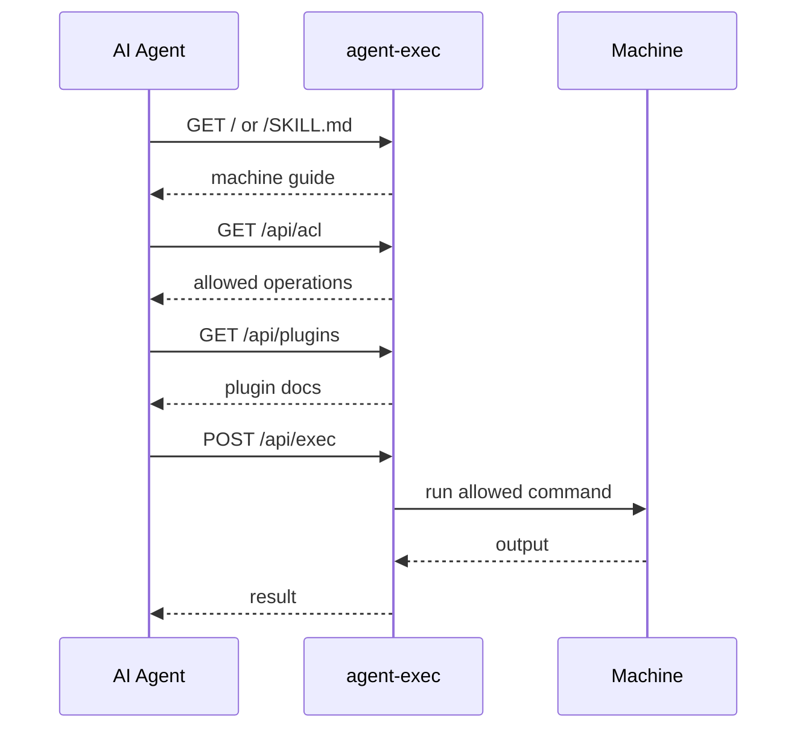

<h1 align="center">
  <br>
  
  <br>
</h1>

<p align="center">
  AI エージェント向けの SSH-like なマシンアクセス。マシン自身が使い方を説明し、アクセス制御で操作範囲を絞る HTTP 入口です。
</p>

<p align="center">
  <strong>AI エージェントにマシンの入口を渡す。マシンが使い方を説明し、サーバーが許可範囲を守ります。</strong>
</p>

<p align="center">
  初期状態は安全側です。許可されるのは <code>aexec --version</code> だけです。
  実用的な操作は、選択した starterkit または plugin で公開します。
</p>

<p align="center">
  <a href="https://github.com/to-agent/agent-exec#readme">English</a> |
  <a href="https://github.com/to-agent/agent-exec/blob/main/docs/i18n/README.ja.md">日本語</a> |
  <a href="https://github.com/to-agent/agent-exec/blob/main/docs/i18n/README.zh.md">简体中文</a>
</p>

---

## クイックスタート

Node.js と npm が入っているマシンで実行します。

```bash
npm i -g @to-agent/agent-exec
```

```bash
aexec setup
```

```bash
aexec start
```

```bash
aexec share
```

生成されたプロンプトを AI エージェントに貼り付けます。

`aexec setup` は local API key と settings を作成します。`aexec start` は endpoint を起動します。`aexec share` は貼り付け用プロンプトを出力します。

`aexec` が正式コマンドです。`ae` は普段使いの短縮エイリアスです。

### 安全な初期値と実用的な操作

上のクイックスタートは意図的に保守的です。初期状態で許可されるのは
`aexec --version` だけなので、エージェントは discovery と `/api/exec` の
疎通確認はできますが、広いマシンアクセスは得ません。

実用的な操作を公開するには、starterkit または plugin を追加し、生成された
settings を確認してから、改めて共有します。

```bash
aexec starterkit
aexec restart
aexec share
```

まだサーバーを起動していない場合は、`aexec start` の前に `aexec starterkit`
を実行できます。すでに起動中の場合は、新しい plugin/runtime settings を
読み込むために `aexec restart` を使います。

`aexec starterkit` は、生成した各 `settings.json` をデフォルトで表示します。
restart 前に新しい `exec.allow` ルールを確認してください。表示を抑制する場合は
`--silent` または `--quiet` を使います。

`aexec share` は次のようなプロンプトを出力します。

```text
agent-exec を通じてマシンにアクセスできます。

Machine: http://127.0.0.1:3333
Skill:   http://127.0.0.1:3333/SKILL.md

Credential:
X-API-Key: <key>
```

Claude、Gemini、Codex、Hermes、OpenClaw など、HTTP リクエストを実行できる AI エージェントに貼り付けます。
デフォルトでは同じマシン上のエージェント向けです。信頼できる LAN や検証用 canary マシンで共有する場合は、ネットワークインターフェースに bind し、到達可能な host を明示します。

```bash
aexec start -f --public
aexec share --ip <reachable-host-or-ip>
```

agent-exec をインターネットへ直接公開しないでください。API key はマシンを操作できる権限として扱い、localhost、VPN、firewall、TLS termination、信頼できるネットワーク境界の内側で使ってください。

共有前に確認してください。

- agent-exec は sandbox ではありません。
- agent-exec は SSH 互換ではなく、SSH の置き換えでもありません。
- 初期状態で許可されるのは `aexec --version` だけです。
- plain HTTP の agent-exec を public internet に公開しないでください。
- agent-exec は最小権限の OS ユーザーで実行してください。

---

## 何をするものか

agent-exec は、AI エージェントがマシンを発見して操作するための小さな入口を提供します。

```text
エージェントがマシンの入口 + credential を受け取る
  -> GET  / or /SKILL.md                  マシンのガイドを読む
  -> GET  /api/acl                        許可された操作を確認する
  -> GET  /api/plugins                    plugin docs を発見する
  -> GET  /private/skills/:name/SKILL.md  リンクされた private plugin docs を読む
  -> POST /api/exec                       許可されたコマンドを実行する
```



エージェントは自律的に発見しますが、許可する内容は常にサーバー側が制御します。

---

## 主要エンドポイント

公開:

| Path | 用途 |
|---|---|
| `GET /` | 実行中サーバーの root guide |
| `GET /SKILL.md` | メインの agent guide |
| `GET /skills` | Skills index |
| `GET /skills/:name/SKILL.md` | 公開 skill docs |

API key 必須:

| Path | 用途 |
|---|---|
| `GET /api/acl` | 許可/拒否コマンド |
| `GET /api/plugins` | インストール済み plugin docs |
| `POST /api/exec` | コマンド実行 |
| `GET /private/skills/:name/SKILL.md` | private plugin docs |

保護された API にはヘッダーを使います。

```bash
curl -H "X-API-Key: <key>" http://localhost:3333/api/acl
```

`Authorization: Bearer <key>` も対応しています。クエリ文字列での認証はデフォルト無効で、明示的な互換用途に限って使う想定です。

---

## 実行

コマンドは引数配列（`args`）として送信します。

```bash
curl -X POST http://localhost:3333/api/exec \
  -H "X-API-Key: <key>" \
  -H "Content-Type: application/json" \
  -d '{"args": ["aexec", "--version"]}'
```

### 実行のルール

`/api/exec` は JSON body の args だけを受け付けます。

```json
{"args": ["command", "arg1", "arg2"]}
```

agent-exec は `args` を引数配列として実行します。シェル経由では実行せず、クエリ文字列から command / args を受け取りません。

具体的には:

- `GET /api/exec` は実行しません。HTTP 405 を返します。
- `POST /api/exec?cmd=...` と `POST /api/exec?args=...` は、クエリ文字列で指定された command を実行しません。
- `&&`, `;`, `|`, リダイレクト、サブシェル構文などのシェル特殊文字は agent-exec 自体では解釈されません。
- ACL は、送信されたコマンド名と引数をサーバー側で判定します。
- `exec.deny` は `exec.allow` より先に評価されます。
- 通常の文字列 ACL ルールは完全一致のみです。広い一致を意図する場合は、`*` を使う glob ルールまたは `/.../` の regex ルールを明示してください。
- `args` 以外のリクエスト body 項目は拒否されます。v0.1 の `/api/exec` は `cmd`, `command`, `env`, `cwd`, `shell` を受け付けません。
- `npm test` のような tool を許可すると、その tool 自体が project script を実行する場合があります。agent-exec は外側の実行境界を制御しますが、許可済み tool の sandbox ではありません。

---

## ACL

agent-exec は、許可されていないマシン操作を拒否する設計です。初期状態では `/api/exec` の動作確認用に `aexec --version` だけを許可します。

`aexec setup` が作成するホスト側の設定ファイルを編集します。

```bash
~/.to-agent/agent-exec/settings.json
```

```json
{
  "exec": {
    "allow": ["aexec --version", "pwd", "echo *"],
    "deny": ["/^sudo/", "/rm\\s+-rf/"]
  }
}
```

`deny` は `allow` より先に評価されます。ACL は慎重に設定し、agent-exec は最小権限の OS ユーザーで実行してください。

ACL rule の種類:

| Rule | 意味 |
|---|---|
| `"aexec --version"` | 通常の文字列。`aexec` と `--version` の完全一致です。余分な引数は一致しません。 |
| `"echo *"` | glob。明示的なワイルドカード一致で、`echo` への任意の引数を許可します。 |
| `"/^sudo/"` | regexp。明示的な `/.../` パターンです。 |
| `"*"` | deny されない全 command を許可します。共有マシンや外部から到達可能なマシンでは避けてください。 |

`"cmd *"` のような rule は `cmd` への任意の引数を許可します。そのコマンド自体が安全性を強制できる場合だけ使ってください。`exec.deny` は常に `exec.allow` より先に評価されます。

### 設定の反映タイミング

`aexec setup` は `~/.to-agent/agent-exec/settings.json` を作成します。通常はこのファイルを編集します。

設定は、挙動が予測しやすいように 2 種類に分かれます。

次の設定は `aexec refresh` や restart なしで自動反映されます。

- `exec.allow`
- `exec.deny`
- `ip.allow`
- `ip.deny`
- `timeoutMs`
- `maxOutputBytes`
- `maxStreamBytes`
- `maxConcurrentExec`
- `killGraceMs`
- `audit.enabled`
- `audit.file`

次の設定は、サーバー起動時または plugin snapshot 作成時に使われるため `aexec restart` が必要です。

- `.env`, `API_KEY`, `HOST`, `PORT`
- `AGENT_EXEC_ENABLED`, `AGENT_EXEC_ALLOW_QUERY_API_KEY`
- `maxRequestBodyBytes`, `rateLimit`
- plugin create / enable / runtime settings edits
- plugin remove / disable 後は runtime code を完全に unload するため restart 推奨

top-level の `aexec refresh` はありません。policy settings は自動反映され、plugin / runtime の変更は restart が必要です。実際にどのファイルが使われているか、どの設定に restart が必要かは次で確認できます。

```bash
aexec config
```

---

## Plugins

Plugins はドキュメントと任意のコマンド動作を追加します。

```bash
aexec plugin list
aexec plugin create --name=mytool --command=mytool
aexec plugin enable --name=mytool
aexec plugin disable --name=mytool
aexec plugin doctor
```

`aexec plugin create` は、生成した `settings.json` をデフォルトで表示します。restart 前に `exec.allow` ルールを確認してください。表示を抑制する場合は `--silent` または `--quiet` を使います。

plugin の runtime behavior を作成・編集した後は再起動してください。

```bash
aexec restart
```

Plugin の信頼境界:

- skill-only plugin は documentation only です。
- exec plugin は hooks や routes を追加できますが、通常の実行は ACL チェック済みのコマンド実行を通ります。
- trusted plugin は信頼済みのホスト上コードです。direct `api.run` behavior を使えるため、agent-exec の OS ユーザーとして実行されるコードとしてレビューしてください。
- 未レビューの trusted plugin をインストールしないでください。

---

## よく使うコマンド

| Command | 用途 |
|---|---|
| `aexec setup` | local config と API key を作成 |
| `aexec start` | バックグラウンド起動 |
| `aexec start -f` | フォアグラウンド起動 |
| `aexec start -f --public` | `0.0.0.0` に bind してフォアグラウンド起動 |
| `aexec share --ip <host>` | 到達可能な host を明示してプロンプトを出力 |
| `aexec stop` | 停止 |
| `aexec stop --force --port 3333` | 指定 port の process を強制停止 |
| `aexec restart` | 再起動 |
| `aexec restart --force -f --public` | canary 用に強制停止後 foreground/public で再起動 |
| `aexec status` | 状態確認 |
| `aexec config` | 設定ファイルと反映タイミングを表示 |
| `aexec share` | AI エージェント用プロンプトを出力 |
| `aexec key rotate` | ローカル API key をローテーション |
| `aexec starterkit` | 任意: インストール済み AI ツール用 plugin 生成 |
| `aexec plugin ...` | plugin 管理 |

詳細は `aexec <command> --help` を参照してください。

---

## Security Model

agent-exec は sandbox そのものではありません。アクセス制御付きの実行入口です。

AI エージェント向けの SSH-like なマシンアクセスですが、SSH 互換ではなく、SSH の置き換えでもありません。

agent-exec が提供するもの:

- API key 認証
- ACL enforcement
- timeout、output、stream、concurrency limits
- raw API key や stdout/stderr 本文を保存しない local JSONL audit log
- 明示的な `AGENT_EXEC_ENABLED` master switch
- self-hosted operation

管理者が責任を持つもの:

- 許可するコマンド
- インターネットへ直接公開しないこと
- localhost、VPN、firewall、TLS termination、信頼できるネットワーク境界の利用
- public network 上で plain HTTP を使わないこと
- 最小権限の OS ユーザーで実行すること
- firewall / VPN / IP allowlist
- process / filesystem isolation
- API key が漏れた場合のローテーション: `aexec key rotate`

SSH と同じ考え方です。daemon は access surface を提供します。何を通すかは管理者の判断です。

---

## ライセンス

Apache License 2.0。

OSS core は Apache-2.0 で提供します。商用サービスと to-agent trademarks は別の条件で提供される場合があります。
