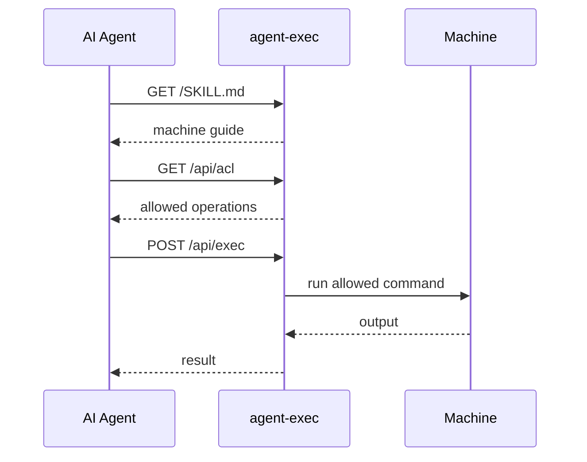

<h1 align="center">
  <br>
  
  <br>
</h1>

<p align="center">
  面向 AI 智能体的 SSH-like machine access。一个自描述、ACL 控制的 HTTP 入口。
</p>

<p align="center">
  <strong>给智能体 URL 和 API key。它读取 /SKILL.md，检查 /api/acl，并通过 /api/exec 执行。</strong>
</p>

<p align="center">
  <a href="../../README.md">English</a> |
  <a href="README.ja.md">日本語</a> |
  <a href="README.zh.md">简体中文</a>
</p>

---

## 快速开始

在已安装 Node.js 和 npm 的机器上：

```bash
npm i -g @to-agent/agent-exec

aexec setup        # 生成 API key
aexec start        # 启动服务器
aexec share        # 生成给 AI 智能体的提示词
```

`aexec` 是正式命令。`ae` 是日常使用的短别名。

`aexec share` 会输出类似这样的提示词：

```text
您可以通过 agent-exec 访问一台机器。

URL: http://127.0.0.1:3333
API_KEY: <key>

从这里开始:
http://127.0.0.1:3333/SKILL.md
```

把它粘贴给 Claude、Gemini、Codex、Hermes、OpenClaw，或任何能发起 HTTP 请求的 AI 智能体。
默认用于同一台机器上的智能体。如果要在可信 LAN 或 disposable canary 机器中共享，请绑定到网络接口，并显式指定可访问的 host。

```bash
aexec start -f --public
aexec share --ip <reachable-host-or-ip>
```

不要把 agent-exec 直接暴露到 public internet。请把 API key 视为 machine execution capability，并只在 localhost、VPN、firewall、TLS termination 或可信 network boundary 内使用。

共享前请确认：

- agent-exec 不是 sandbox。
- agent-exec 不兼容 SSH，也不是 SSH replacement。
- fresh install 默认只允许 `aexec --version`。
- 不要把 plain HTTP 的 agent-exec 暴露到 public internet。
- 请使用 least-privileged OS user 运行 agent-exec。

如果你希望把本机已安装的 AI 工具暴露为 plugin skills，可选择执行：

```bash
aexec starterkit
aexec restart
```

`aexec starterkit` 默认会输出每个生成的 `settings.json`，以便你在重启前检查新的 `exec.allow` 规则。使用 `--silent` 或 `--quiet` 可以隐藏该输出。

---

## 它做什么

agent-exec 为 AI 智能体提供一个小型、自描述的机器入口。

```text
智能体收到 URL + API key
  -> GET  /SKILL.md       读取机器说明
  -> GET  /api/acl        检查允许的操作
  -> GET  /api/plugins    发现可选 plugin docs
  -> POST /api/exec       执行允许的命令
```



智能体负责发现，机器负责决定允许什么。

---

## 核心端点

公开:

| Path | 用途 |
|---|---|
| `GET /` | 运行时 root guide |
| `GET /SKILL.md` | 主 agent guide |
| `GET /skills` | Skills index |
| `GET /skills/:name/SKILL.md` | 公开 skill docs |

需要 API key:

| Path | 用途 |
|---|---|
| `GET /api/acl` | 允许/拒绝的命令 |
| `GET /api/plugins` | 已安装 plugin docs |
| `POST /api/exec` | 执行命令 |
| `GET /private/skills/:name/SKILL.md` | private plugin docs |

受保护 API 推荐使用 header：

```bash
curl -H "X-API-Key: <key>" http://localhost:3333/api/acl
```

也支持 `Authorization: Bearer <key>`。query string 认证默认关闭，仅适用于明确的兼容用途。

---

## 执行

命令以 args 数组发送：

```bash
curl -X POST http://localhost:3333/api/exec \
  -H "X-API-Key: <key>" \
  -H "Content-Type: application/json" \
  -d '{"args": ["aexec", "--version"]}'
```

### 执行语义

`/api/exec` 只接受 JSON body 中的 args：

```json
{"args": ["command", "arg1", "arg2"]}
```

agent-exec 会把 `args` 作为 argv 执行。它不会把命令作为 shell string 执行，也不会从 query string 接收 command / args。

实际含义：

- `GET /api/exec` 不会执行命令，会返回 HTTP 405。
- `POST /api/exec?cmd=...` 和 `POST /api/exec?args=...` 不会执行 query-string command。
- `&&`、`;`、`|`、redirect、subshell syntax 等 shell metacharacters 不会被 agent-exec 自身解释。
- ACL matching 使用 `args.join(' ')`。
- `exec.deny` 先于 `exec.allow` 执行。
- plain string ACL rule 只做完全匹配。如果需要更宽的匹配，请显式使用带 `*` 的 glob rule，或使用 `/.../` regex rule。
- 除 `args` 以外的 request body field 会被拒绝。v0.1 的 `/api/exec` 不接受 `cmd`、`command`、`env`、`cwd`、`shell`。
- 如果允许 `npm test` 这样的工具，该工具本身可能会执行 project scripts。agent-exec 控制外层 execution boundary，但不是已允许工具的 sandbox。

---

## ACL

agent-exec 对 machine operation 默认拒绝。fresh install 只允许 `aexec --version` 作为 `/api/exec` 的自检命令。

编辑由 `aexec setup` 创建的主机侧配置文件：

```bash
~/.to-agent/agent-exec/settings.json
```

```json
{
  "exec": {
    "allow": ["aexec --version", "pwd", "echo *"],
    "deny": ["/^sudo/", "/rm\\s+-rf/"]
  }
}
```

`deny` 会先于 `allow` 执行。请谨慎配置 ACL，并使用最小权限 OS 用户运行 agent-exec。

ACL rule 类型：

| Rule | 含义 |
|---|---|
| `"aexec --version"` | plain string。对 `args.join(' ')` 做完全匹配。 |
| `"echo *"` | glob。显式 wildcard match，允许传给 `echo` 的任意 args。 |
| `"/^sudo/"` | regexp。显式 `/.../` pattern。 |
| `"*"` | 允许所有未被 deny 的 command。请避免在共享或外部可访问的机器上使用。 |

类似 `"cmd *"` 的 rule 会允许传给 `cmd` 的任意 args。只有当该 command 自身能强制安全行为时才使用。`exec.deny` 始终先于 `exec.allow` 执行。

### 配置生效时机

`aexec setup` 会创建 `~/.to-agent/agent-exec/settings.json`。通常编辑这个文件。

配置分为两类，这样生效时机更容易预测。

以下配置会自动生效，不需要 `aexec refresh` 或重启：

- `exec.allow`
- `exec.deny`
- `ip.allow`
- `ip.deny`
- `timeoutMs`
- `maxOutputBytes`
- `maxStreamBytes`
- `maxConcurrentExec`
- `killGraceMs`
- `audit.enabled`
- `audit.file`

以下配置在服务器启动或 plugin snapshot 创建时使用，因此需要 `aexec restart`：

- `.env`, `API_KEY`, `HOST`, `PORT`
- `AGENT_EXEC_ENABLED`, `AGENT_EXEC_ALLOW_QUERY_API_KEY`
- `maxRequestBodyBytes`, `rateLimit`
- plugin create / enable / runtime settings edits
- plugin remove / disable 后，建议 restart 以完全卸载 runtime code

没有顶层 `aexec refresh`：policy settings 会自动生效，plugin / runtime 变更需要重启。查看实际使用的配置文件以及哪些配置需要重启：

```bash
aexec config
```

---

## Plugins

Plugins 可以添加文档和可选的 command behavior。

```bash
aexec plugin list
aexec plugin create --name=mytool --command=mytool
aexec plugin enable --name=mytool
aexec plugin disable --name=mytool
aexec plugin doctor
```

`aexec plugin create` 默认会输出生成的 `settings.json`。请在重启前检查其中的 `exec.allow` 规则。使用 `--silent` 或 `--quiet` 可以隐藏该输出。

创建或修改 plugin runtime behavior 后请重启：

```bash
aexec restart
```

Plugin trust boundary:

- skill-only plugin 只提供 documentation。
- exec plugin 可以添加 hooks 和 routes，但普通执行仍会经过 ACL-checked command execution。
- trusted plugin 是 trusted host code。它可以使用 direct `api.run` behavior，应像审查以 agent-exec OS user 运行的代码一样审查它。
- 不要安装未经审查的 trusted plugin。

---

## 常用命令

| Command | 用途 |
|---|---|
| `aexec setup` | 创建 local config 和 API key |
| `aexec start` | 后台启动 |
| `aexec start -f` | 前台启动 |
| `aexec start -f --public` | 绑定到 `0.0.0.0` 并前台启动 |
| `aexec share --ip <host>` | 使用显式可访问 host 输出提示词 |
| `aexec stop` | 停止 |
| `aexec stop --force --port 3333` | 强制停止占用指定 port 的 process |
| `aexec restart` | 重启 |
| `aexec restart --force -f --public` | canary 用：强制停止后以前台/public 方式重启 |
| `aexec status` | 查看状态 |
| `aexec config` | 显示配置文件和生效时机 |
| `aexec share` | 输出给 AI 智能体的提示词 |
| `aexec key rotate` | 轮换 local API key |
| `aexec starterkit` | 可选：为已安装 AI 工具生成 plugin |
| `aexec plugin ...` | 管理 plugins |

运行 `aexec <command> --help` 查看命令帮助。

---

## Security Model

agent-exec 本身不是 sandbox。它是一个 policy-gated execution surface。

它是面向 AI 智能体的 SSH-like machine access，但不兼容 SSH，也不是 SSH replacement。

agent-exec 提供：

- API key authentication
- ACL enforcement
- timeout、output、stream、concurrency limits
- 不记录 raw API key 或 stdout/stderr 正文的 local JSONL audit log
- 显式 `AGENT_EXEC_ENABLED` master switch
- self-hosted operation

管理员负责：

- 允许哪些命令
- 不要直接暴露到 public internet
- 使用 localhost、VPN、firewall、TLS termination 或可信 network boundary
- 避免在 public network 上使用 plain HTTP
- 使用 least-privileged OS user 运行
- firewall / VPN / IP allowlist
- process / filesystem isolation
- API key 泄露时执行轮换：`aexec key rotate`

和 SSH 的原则相同：daemon 提供 access surface，允许什么由管理员决定。

---

## 许可证

Apache License 2.0。

开源核心采用 Apache-2.0 许可。商业服务和 to-agent trademarks 可能会在单独条款下提供。
