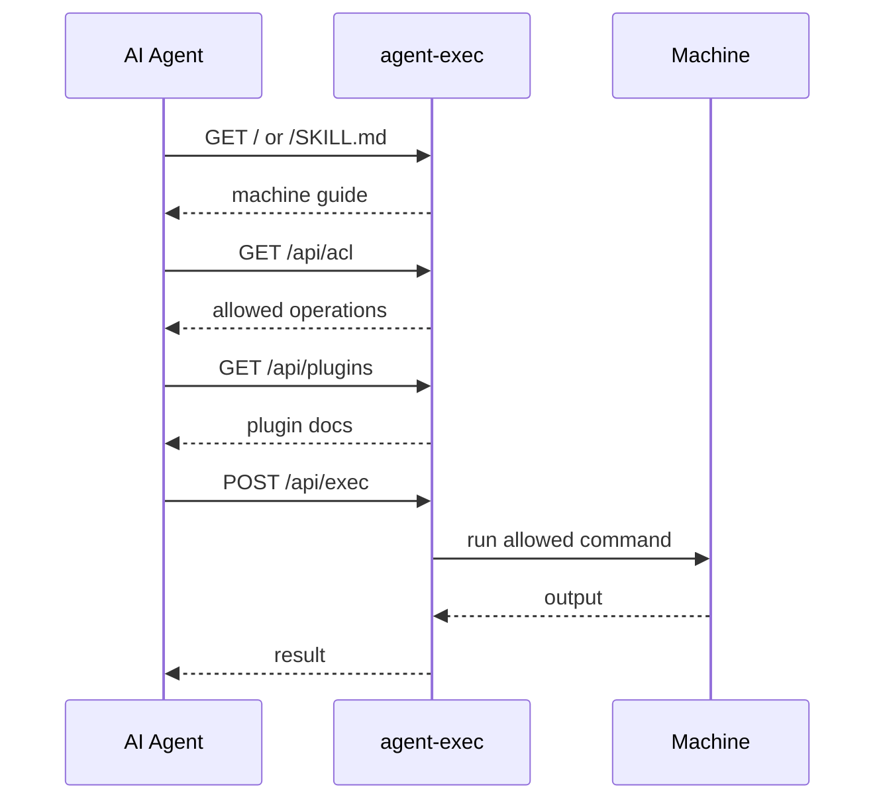

<h1 align="center">
  <br>
  
  <br>
</h1>

<p align="center">
  面向 AI 智能体的 SSH-like 机器访问。机器会说明自己的用法，并通过访问控制限制可执行范围。
</p>

<p align="center">
  <strong>给 AI 智能体一个机器入口。机器说明自己，服务器强制执行允许范围。</strong>
</p>

<p align="center">
  初始状态默认保守：只允许 <code>aexec --version</code>。
  有用的操作需要通过你选择的 starterkit 或 plugin 暴露。
</p>

<p align="center">
  <a href="https://github.com/to-agent/agent-exec#readme">English</a> |
  <a href="https://github.com/to-agent/agent-exec/blob/main/docs/i18n/README.ja.md">日本語</a> |
  <a href="https://github.com/to-agent/agent-exec/blob/main/docs/i18n/README.zh.md">简体中文</a>
</p>

---

## 快速开始

在已安装 Node.js 和 npm 的机器上：

```bash
npm i -g @to-agent/agent-exec@latest
```

```bash
aexec setup        # 生成 API_KEY
```

```bash
aexec start        # 启动服务器
```

```bash
aexec share        # 生成给 AI 智能体的提示词
```

然后把生成的提示词粘贴给 AI 智能体。

`aexec setup` 会创建 local API_KEY 和 settings。`aexec start` 会启动 endpoint。`aexec share` 会输出可粘贴的提示词。

`aexec` 是正式命令。`ae` 是日常使用的短别名。

### 安全默认值与有用操作

上面的快速开始是有意保守的。初始状态默认只允许
`aexec --version`，因此智能体可以验证 discovery 和 `/api/exec` 是否可用，
但不会获得宽泛的机器访问权限。

如果要暴露有用操作，请添加 starterkit 或 plugin，检查生成的 settings，
然后再次分享这台机器：

```bash
aexec starterkit
aexec restart
aexec share
```

如果服务器尚未启动，可以在 `aexec start` 之前运行 `aexec starterkit`。
如果服务器已经在运行，请使用 `aexec restart` 来加载新的 plugin/runtime settings。

`aexec starterkit` 默认会输出每个生成的 `settings.json`，以便你在重启前
检查新的 `exec.allow` 规则。使用 `--silent` 或 `--quiet` 可以隐藏该输出。

Starter Kit 和 `aexec plugin create` 默认只生成保守的 ACL。手动 plugin 使用
`<cmd> --help` / `<cmd> --version`，基于扫描生成的 plugin 只使用实际检测到的
help/version flag。它们不会生成宽泛的 `cmd *` rule。重启前可以用
`aexec plugin doctor` 检测 broad wildcard ACL。

`aexec share` 会输出类似这样的提示词：

```text
您可以通过 agent-exec 访问一台机器。

URL:     http://127.0.0.1:3333
API_KEY: <API_KEY>

从这里开始:
http://127.0.0.1:3333/SKILL.md
```

把它粘贴给 Claude、Gemini、Codex、Hermes、OpenClaw，或任何能发起 HTTP 请求的 AI 智能体。
默认用于同一台机器上的智能体。如果要在可信 LAN 或一次性 canary 机器中共享，请绑定到网络接口，并显式指定可访问的 host。

```bash
aexec start -f --public
aexec share --ip <reachable-host-or-ip>
```

不要把 agent-exec 直接暴露到公网。请把 API_KEY 视为可操作机器的权限，并只在 localhost、VPN、firewall、TLS termination 或可信网络边界内使用。

共享前请确认：

- agent-exec 不是 sandbox。
- agent-exec 不兼容 SSH，也不是 SSH replacement。
- 初始状态默认只允许 `aexec --version`。
- 不要把 plain HTTP 的 agent-exec 暴露到公网。
- 请使用最小权限 OS 用户运行 agent-exec。

---

## 它做什么

agent-exec 为 AI 智能体提供一个小型、自描述的机器入口。

```text
智能体收到机器入口 + credential
  -> GET  / or /SKILL.md                  读取机器说明
  -> GET  /api/acl                        检查允许的操作
  -> GET  /api/plugins                    发现可选 plugin docs
  -> GET  /private/skills/:name/SKILL.md  读取被链接的 private plugin docs
  -> POST /api/exec                       执行允许的命令
```



智能体负责发现，机器负责决定允许什么。

---

## 核心端点

公开:

| Path | 用途 |
|---|---|
| `GET /` | 运行时 root guide |
| `GET /SKILL.md` | 主 agent guide |
| `GET /skills` | Skills index |
| `GET /skills/:name/SKILL.md` | 公开 skill docs |

通常的 discovery 从 `/` 或 `/SKILL.md` 开始。Skill document 也可以通过
`.json`、`.html` 以及 Skill Script `.s.js` / `.sjs` 获取，用作可直接访问的
机器可读 surface。例如 `/SKILL.s.js`、`/api/acl/SKILL.s.js`、
`/api/exec/SKILL.s.js`、`/skills/:name/SKILL.s.js` 都是 documentation
surface。public API skill document 可以被发现，但 API runtime call 以及
`/private/*` 等 private namespace 仍然需要 API_KEY。

需要 API_KEY:

| Path | 用途 |
|---|---|
| `GET /api/acl` | 允许/拒绝的命令 |
| `GET /api/plugins` | 已安装 plugin docs |
| `POST /api/exec` | 执行命令 |
| `GET /private/skills/:name/SKILL.md` | private plugin docs |

受保护 API 推荐使用 header：

```bash
curl -H "X-API-Key: <API_KEY>" http://localhost:3333/api/acl
```

也支持 `Authorization: Bearer <API_KEY>`。查询字符串认证默认关闭，仅适用于明确的兼容用途。

---

## 执行

命令以参数数组（`args`）发送：

```bash
curl -X POST http://localhost:3333/api/exec \
  -H "X-API-Key: <API_KEY>" \
  -H "Content-Type: application/json" \
  -d '{"args": ["aexec", "--version"]}'
```

### 执行规则

`/api/exec` 接受 JSON body 中的 args：

```json
{"args": ["command", "arg1", "arg2"]}
```

agent-exec 会把 `args` 作为参数数组执行。它不通过 shell 执行，也不会从查询字符串接收 command / args。

实际含义：

- `GET /api/exec` 不会执行命令，会返回 HTTP 405。
- `POST /api/exec?cmd=...` 和 `POST /api/exec?args=...` 不会执行查询字符串中指定的 command。
- `&&`、`;`、`|`、重定向、子 shell 语法等 shell 特殊字符不会被 agent-exec 自身解释。
- ACL 会在服务器侧判断提交的命令名和参数。
- `exec.deny` 先于 `exec.allow` 执行。
- 普通字符串 ACL 规则只做完全匹配。如果需要更宽的匹配，请显式使用带 `*` 的 glob 规则，或使用 `/.../` regex 规则。
- 除 `args` 和可选 `memo` 以外的请求体字段会被拒绝。`/api/exec` 不接受 `cmd`、`command`、`env`、`cwd`、`shell`。
- 如果允许 `npm test` 这样的工具，该工具本身可能会执行 project scripts。agent-exec 控制外层执行边界，但不是已允许工具的 sandbox。

---

## ACL

agent-exec 对机器操作默认拒绝。初始状态只允许 `aexec --version` 作为 `/api/exec` 的自检命令。

常见 allow rule 编辑可以使用 ACL CLI：

```bash
aexec acl list
aexec acl add "date"
aexec acl add "codex *" --force --yes
aexec acl remove "date" --yes
aexec acl remove --contains "codex" --yes
aexec acl doctor
```

`aexec acl add` 会写入常规 user settings file。完全匹配规则在 TTY 中会要求确认，非交互使用需要 `--yes`。宽泛的 glob 或 regexp allow rule 需要更明确的意图；非交互使用需要 `--force --yes`。`aexec acl remove --contains <text>` 会在确认后删除匹配的 user allow rule。user ACL 变更会被正在运行的 server 在下一次 `/api/exec` request 中读取。`aexec acl doctor` 会报告当前有效的 broad allow rule。

编辑由 `aexec setup` 创建的主机侧配置文件：

```bash
~/.to-agent/agent-exec/settings.json
```

```json
{
  "exec": {
    "allow": ["aexec --version", "date", "echo agent exec ok"],
    "deny": ["/^sudo/", "/rm\\s+-rf/"]
  }
}
```

`deny` 会先于 `allow` 执行。请谨慎配置 ACL，并使用最小权限 OS 用户运行 agent-exec。

ACL rule 类型：

| Rule | 含义 |
|---|---|
| `"aexec --version"` | 普通字符串。只匹配 `aexec` 和 `--version` 这一组命令和参数；额外参数不会匹配。 |
| `"echo *"` | glob。显式通配符匹配，允许传给 `echo` 的任意参数。 |
| `"/^sudo/"` | regexp。显式 `/.../` 模式。 |
| `"*"` | 允许所有未被 deny 的 command。请避免在共享或外部可访问的机器上使用。 |

类似 `"cmd *"` 的 rule 会允许传给 `cmd` 的任意参数。只有当该命令自身能强制安全行为时才使用。`exec.deny` 始终先于 `exec.allow` 执行。

### 配置生效时机

`aexec setup` 会创建 `~/.to-agent/agent-exec/settings.json`。通常编辑这个文件。

配置分为两类，这样生效时机更容易预测。

以下配置会自动生效，不需要 `aexec refresh` 或重启：

- `exec.allow`
- `exec.deny`
- `ip.allow`
- `ip.deny`
- `timeoutMs`
- `maxOutputBytes`
- `maxStreamBytes`
- `maxConcurrentExec`
- `killGraceMs`
- `audit.enabled`
- `audit.file`

以下配置在服务器启动或 plugin snapshot 创建时使用，因此需要 `aexec restart`：

- `.env`, `API_KEY`, `HOST`, `PORT`
- `AGENT_EXEC_ENABLED`, `AGENT_EXEC_ALLOW_QUERY_API_KEY`
- `maxRequestBodyBytes`, `rateLimit`
- plugin create / enable / runtime settings edits
- plugin remove / disable 后，建议 restart 以完全卸载 runtime code

没有顶层 `aexec refresh`：policy settings 会自动生效，plugin / runtime 变更需要重启。查看实际使用的配置文件以及哪些配置需要重启：

```bash
aexec config
```

### Reset local config

如果要把 active local config 移到备份位置，并让机器回到安全的初始状态，
使用 `reset`：

```bash
aexec reset --yes
```

`aexec reset` 和 `aexec setup` 的职责不同：

- `aexec setup` 用于首次设置，创建缺失的文件。
- `aexec reset` 会备份当前 config directory，把它从 active 位置移走，
  然后重新创建最小 config。

默认备份位置：

```text
~/.to-agent/backups/agent-exec/reset-YYYYMMDD-HHMMSS/
```

备份中包含旧的 `.env`, `settings.json`, `plugins/`。新的 config 会重新创建
`.env`, `settings.json`, 以及空的 `plugins/`。reset 后的 settings 只允许
`aexec --version`。

API_KEY 行为：

- 默认：生成新的 API_KEY。
- `--keep-api-key`：复用当前 API_KEY。
- `--api-key <key>`：写入指定 API_KEY，适合实验或设备设置。

检查与显式破坏模式：

- `--dry-run`：不修改文件，只显示将会发生什么。
- `--json`：以 machine-readable JSON 输出 reset 结果。
- `--no-backup`：不备份，直接移除 active config。只有在明确不需要旧 config
  时才使用。

如果远程测试机器需要保留已经分享过的 credential：

```bash
aexec reset --keep-api-key --yes
aexec start --public
```

---

## Plugins

Plugins 可以添加文档和可选的命令行为。

```bash
aexec plugin list
aexec plugin create --name=mytool --command=mytool
aexec plugin enable --name=mytool
aexec plugin disable --name=mytool
aexec plugin doctor
```

`aexec plugin create` 默认会输出生成的 `settings.json`。请在重启前检查其中的 `exec.allow` 规则。使用 `--silent` 或 `--quiet` 可以隐藏该输出。

生成的 plugin ACL 会刻意保持较窄。只有在检查生成的 skill 和 CLI 行为后，才手动添加更宽泛的 pattern。`aexec plugin doctor` 会报告 `*` 或 `cmd *` 这类 broad wildcard rule。

创建或修改 plugin runtime behavior 后请重启：

```bash
aexec restart
```

Plugin 的信任边界:

- skill-only plugin 只提供 documentation。
- exec plugin 可以添加 hooks 和 routes，但普通执行仍会经过 ACL 检查的命令执行。
- trusted plugin 是受信任的主机侧代码。它可以使用 direct `api.run` behavior，应像审查以 agent-exec OS 用户权限运行的代码一样审查它。
- 不要安装未经审查的 trusted plugin。

---

## 常用命令

| Command | 用途 |
|---|---|
| `aexec setup` | 创建 local config 和 API_KEY |
| `aexec start` | 后台启动 |
| `aexec start -f` | 前台启动 |
| `aexec start -f --public` | 绑定到 `0.0.0.0` 并前台启动 |
| `aexec share --ip <host>` | 使用显式可访问 host 输出提示词 |
| `aexec stop` | 停止 |
| `aexec stop --force --port 3333` | 强制停止占用指定 port 的 process |
| `aexec restart` | 重启 |
| `aexec restart --force -f --public` | canary 用：强制停止后以前台/public 方式重启 |
| `aexec update --restart --public` | 更新 package 后，以 `0.0.0.0` bind 重启 |
| `aexec status` | 查看状态 |
| `aexec config` | 显示配置文件和生效时机 |
| `aexec share` | 输出给 AI 智能体的提示词 |
| `aexec key rotate` | 轮换本地 API_KEY |
| `aexec acl ...` | 管理 `exec.allow` rule |
| `aexec reset --yes` | 备份并重建 local config |
| `aexec starterkit` | 可选：为已安装 AI 工具生成 plugin |
| `aexec plugin ...` | 管理 plugins |

运行 `aexec <command> --help` 查看命令帮助。

---

## Security Model

agent-exec 本身不是 sandbox。它是一个带访问控制的执行入口。

它是面向 AI 智能体的 SSH-like 机器访问，但不兼容 SSH，也不是 SSH replacement。

agent-exec 提供：

- API_KEY authentication
- ACL enforcement
- timeout、output、stream、concurrency limits
- 不记录 raw API_KEY 或 stdout/stderr 正文的 local JSONL audit log
- 显式 `AGENT_EXEC_ENABLED` master switch
- self-hosted operation

管理员负责：

- 允许哪些命令
- 不要直接暴露到公网
- 使用 localhost、VPN、firewall、TLS termination 或可信网络边界
- 避免在 public network 上使用 plain HTTP
- 使用最小权限 OS 用户运行
- firewall / VPN / IP allowlist
- process / filesystem isolation
- API_KEY 泄露时执行轮换：`aexec key rotate`

和 SSH 的原则相同：daemon 提供 access surface，允许什么由管理员决定。

---

## 许可证

Apache License 2.0。

开源核心采用 Apache-2.0 许可。商业服务和 to-agent trademarks 可能会在单独条款下提供。
